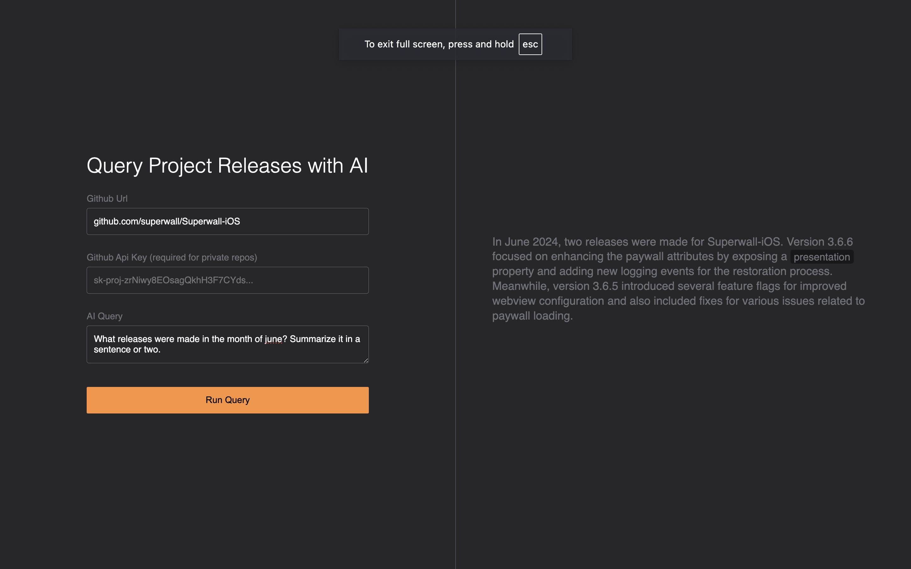

# Superwall AI App



Created from Effect Monorepo

```ts
git clone https://github.com/jessekelly881/superwall-project
cd superwall-project
pnpm install
```

## Server

Requires a .env file (in the packages/server directory) with:

```env
OPENAI_API_KEY=
```

Starting the server:

```ts
cd packages/server
pnpm run dev
```

Api Docs: <http://localhost:3000/docs>

Has the effect DevTools layer setup so you can see traces using the "Effect Dev Tools" vscode extension.

## Client

```ts
cd packages/app
pnpm run dev
```

App: <http://localhost:5173/>

## Potential Improvements

-   Create a websocket connection instead of an api to allow for back and forth communication between the client and ai agent.

-   Creating a persistent ai agent trained on the data from the releases api that can be used across multiple client sessions without having to send release data to the ai agent for each new session.
